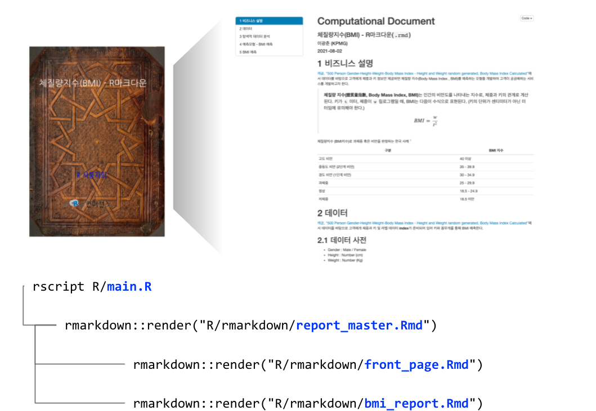
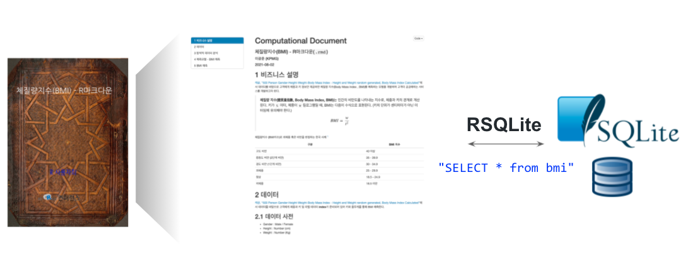

# 전문 보고서

전문 보고서를 제작하는데 첫장은 `magick` 팩키지를 사용해서 외부 이미지와 로고를 넣어 제작한다. 문서는 PDF 파일이라... `Make`와 유사하게 `rscript main.R`에서 `knitr::render()` 함수를 사용해서 `.Rmd` 파일을 뜨게질하여 최종 PDF 파일을 제작하게 한다.

# 백엔드 DB 

SQLite3 데이터베이스를 도입하여 보고서를 기존 로컬 파일에서 데이터베이스에서 가져오도록 강건한 구조를 갖도록 한다.

